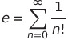
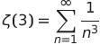
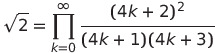

## Domáca úloha 1 

Na úložisku pre odovzdávanie zadaní nájdete Python skript s názvom `h01.py`, ktorý obsahuje kód jednoduchej funkcie. Vašou úlohou je vytvoriť k funkcii vývojový diagram. Vývojový diagram nahrajte ako PDF súbor `h01.pdf` (za nesprávny formát súboru sa stiahne pol boda), na jeho vytvorenie môžete použiť ľubovoľný nástroj, napr. [draw.io](https://www.draw.io). V dokumente uveďte meno funkcie alebo číslo úlohy.

Ak počas riešenia spolupracujete so spolužiakom, jeho/jej meno uveďte v hlavičke skriptu `h01.py`. V hlavičke tiež uveďte zdroje, ktoré ste použili pri vypracovaní riešenia, ako aj približný čas, ktorý ste potrebovali na vypracovanie domácej úlohy.

**Poznámka:** Ak funkcia má parametre, tie nemusíte zadefinovať zvlášť vo vývojovom diagrame, môžete ich považovať za zadefinované. Ak sa ale vo funkcii načíta vstup od používateľa, tento krok musí mať príslušný blok.

## Domáca úloha 2 

Na úložisku pre odovzdávanie zadaní nájdete Python skript s názvom `h02.py`, ktorý obsahuje popis troch zoznamov a jednej lambda výrazu. Vašou úlohou je vygenerovať zoznamy pomocou list comprehension na základe zadanej špecifikácie (riadky 10, 14, 18), a zadefinovať lambda výraz podľa špecifikácie (riadok 22). Ak pri generovaní zoznamov potrebujete vytvoriť pomocné premenné (napríklad potrebujete vygenerovať zoznam kombinácií prvkov dvoch zoznamov, alebo hľadáte isté písmená v stringu), môžete tak urobiť ľubovoľným spôsobom.

Ak počas riešenia spolupracujete so spolužiakom, jeho/jej meno uveďte v hlavičke skriptu `h02.py`. V hlavičke tiež uveďte zdroje, ktoré ste použili pri vypracovaní riešenia, ako aj približný čas, ktorý ste potrebovali na vypracovanie domácej úlohy.

## Domáca úloha 3 

Na úložisku pre odovzdávanie zadaní nájdete Python skript s názvom `h03.py`, ktorý obsahuje deklaráciu generátora alebo funkcie pre implementáciu vybraného triediaceho algoritmu. Vašou úlohou je implementovať algoritmus ako generátor, resp. funkciu. Každý generátor a funkcia má dva parametre:

* `lst` - zoznam hodnôt, ktoré potrebujete zoradiť. Upravujte priamo tento zoznam, a generátory majú vracať tento zoznam ako medzivýsledok.
* `ascending` - hodnota určí smer zoradenia. Ak hodnota je `True`, chceme zoradiť od najmenšieho prvko po najväčší, v prípade `False` naopak. **Funkcionalitu môžete implementovať cez funkciu `reverse` len v prípade algoritmov radix a bucket sort.**

Vaše riešenia budú hodnotené automatickým testom, práve preto musíte dodržať formu implementácie a spôsobu získania medzivýsledkov. Za správny výsledok dostanete 0,5 boda, za správne medzivýsledky 0,5 b; test pobeží dvakrát, raz s `ascending=True`, raz s `ascending=False`. Skript obsahuje aj funkciu `main` s volaním funkcie a výpismi, ktoré sa budú kontrolovať. Skript takisto obsahuje ukážku pre medzivýsledky a správny výstup. Pri riešení môžete používať ľubovoľné štandardné funkcie Pythonu (okrem `sort`, resp. `sorted` a `reverse`, resp. `reversed` ak to nie je explicitne povolené).

Niekoľko poznámok k jednotlivým algoritmom:

* **selection sort** - algoritmus implementujte ako generátor, ktorý vracia medzivýsledok po každom iteratívnom kroku; efekt parametra `ascending` musíte zohľadniť už v medzivýsledkoch.
* **bubble sort** - algoritmus implementujte ako generátor, ktorý vracia medzivýsledok po každom iteratívnom kroku; efekt parametra `ascending` musíte zohľadniť už v medzivýsledkoch.
* **insertion sort** - algoritmus implementujte ako generátor, ktorý vracia medzivýsledok po každom iteratívnom kroku; efekt parametra `ascending` musíte zohľadniť už v medzivýsledkoch.
* **quick sort** - algoritmus implementujte ako funkciu; v skripte nájdete aj pomocnú funkciu `partition`, ktorá sa zavolá pre zoradenie hodnôt podľa pivotu (menšie hodnoty doľava, väčšie doprava); ako pivot použite poslednú hodnotu v zozname (v časti zoznamu), pred každým volaním funkcie `partition` uložte hodnoty parametrov `low` a `high` ako n-ticu (tuple) do zoznamu `partition_called_with`; pri hodnotení sa kontroluje aj hodnota zoznamu.
* **merge sort** - algoritmus implementujte ako funkciu; vo funkcii rozdeľte zoznam na dve časti v strede, t.j. `len(lst) // 2`; pred každým volaním funkcie `merge_sort` (okrem prvého volania) uložte hodnotu polovičného bodu do zoznamu `merge_sort_called_with`; pri hodnotení sa kontroluje aj hodnota zoznamu.
* **bucket_sort** - algoritmus implementujte ako funkciu, pri zoradení zoznamov v jednotlivých bucketoch **môžete** použiť funkciu `sort` aj s parametrom `reverse`, zoradenie prvkov v samotnom zozname `lst` ale musíte vyriešiť bez nich (konkatenácia bucketov); použite 10 bucketov, rozdelenie do bucketov riešte cez `10 * number`.
* **radix sort** - algoritmus implementujte ako generátor, ktorý vracia medzivýsledky po každej iterácii, teda po zavolaní pomocnej funkcie `counting_sort`; pre implementáciu efektu parametra `ascending` **môžete** použiť funkciu `reverse` ale až na konci vykonávania (viď príklad v skripte).

## Domáca úloha 4 

Na úložisku pre odovzdávanie zadaní nájdete Python skript s názvom `h04.py`, ktorý obsahuje jednoduchú funkciu a jej krátky popis. Vašou úlohou je upraviť kód funkcie tak, aby splnila špecifikáciu uvedenú v komentároch, a zároveň ošetriť chyby ktoré môžu vyskytnúť počas vykonávania programu. Kód teda potrebujete rozšíriť nasledovne:

1. skontrolovať hodnotu vstupných parametrov podľa špecifikácie (napr. správny typ, správny formát, platná hodnota); ak podmienky nie sú splnené, vygenerujte chybu s príslušnou chybovou správou.
2. otestovať a v prípade potreby doladiť kód aby spĺňal špecifikáciu - kód môže obsahovať chyby, ktoré úplne znemožnia jeho správny beh; unit testy nemusíte písať, stačí ak kód otestujete manuálne na rôznych vstupoch, aby ste odhalili možné chyby.
3. ošetriť možné výnimky - všetky kódy sa spoliehajú na platnosť niektorých predpokladov na vstup alebo využívajú štandardné funkcie jazyka Python, ktoré môžu spôsobiť výnimku počas behu programu. Identifikujte tieto možné chyby a ošetrite ich blokom `try - catch` alebo kontrolou hodnôt ešte pred ich použitím. V oboch prípadoch vygenerujte chybu s príslušnou chybovou správou (nepoužívajte iba štandardné výpisy z Pythonu).

## Domáca úloha 5 

Na úložisku pre odovzdávanie zadaní nájdete Python skript s názvom `h05.py`, ktorý obsahuje jednoduchú funkciu s jej krátkym popisom a s funkciou pre testovanie riešenia. Vašou úlohou je implementovať testovaciu funkciu, a odhaliť a opraviť prípadné chyby v implementácii funkcie. Pri testovaní používajte kľúčové slovo `assert`, môžete sa inšpirovať testami k zadaniu 1. Implementáciu funkcie otestujte na nasledovných vstupoch:

* nesprávny vstup - v takýchto prípadoch funkcia väčšinou iba ukončí vykonávanie (cez `return`). Je na vás, či to necháte tak, alebo pridáte generovanie výnimiek do kódu.
* extrémny vstup - mali by reprezentovať hraničné situácie, kde implementácia môže mať problémy, napríklad malé a veľké vstupy; typický príklad je spracovanie hodnoty 0. Pri niektorých funkciách neexistujú extrémne prípady.
* platné vstupy - otestujte návratovú hodnotu alebo účinok funkcie pre minimálne 10 platných vstupov.

Tieto testy vám môžu pomôcť pri odhalení chyby v implementácii. Prispôsobujte vždy implementáciu k testom, a nie naopak!

## Domáca úloha 6 

Na úložisku pre odovzdávanie zadaní nájdete Python skript s názvom `h06.py`, ktorý obsahuje dve funkcie. Funkcia `load_balance` je mock funkcia a emuluje načítavanie dát z databázy. V systémoch, ktoré pracujú s databázou je načítavanie kritický bod vo funkčnosti programu, keďže zvyčajne trvá dlhší čas. Táto skutočnosť je v kóde simulovaná volaním funkcie `sleep`, ktorá pozastaví vykonávanie kódu na jednu sekundu. Druhá funkcia je `get_balances`, ktorá načíta stav účtu podľa mena držiteľa konta. V hlavnej funkcii sa vygeneruje zoznam 100 mien zo zoznamu, mená sa teda opakujú. Ako môžete vidieť v kóde, `load_balance` sa zavolá v kóde vždy, aj keď chceme načítať stav účtu pre človeka, pre ktorého sme tak už urobili. Toto spôsobí, že kód potrebujete skoro dve minúty pre zbehnutie.

Vašou úlohou je využiť memoizáciu pre zvýšenie efektivity funkcie `get_balances`. Pridajte premennú typu dictionary (reprezentuje tabuľku s čiastočnými výsledkami) do funkcie `get_balances` a následne upravte for cyklus tak, aby sa suma načítala priamo z tabuľky ak tá obsahuje hodnotu pod kľúčom `name`. Ak taký kľúč v tabuľke neexistuje, zavolajte funkciu `load_balance` a pridajte dvojicu kľúč-hodnota (`name` a `balance`) do tabuľky.

## Domáca úloha 7 
Na úložisku pre odovzdávanie zadaní nájdete obrázok s názvom `h07.jpg`, ktorý zobrazuje diagram triedy. Vašou úlohou je implementovať túto triedu v Python skripte s názvom `h07.py` (upravujte priamo skript). Pri implementácii musíte dodržať vlastnosti triedy určené v diagrame.

Každá trieda obsahuje jednu privátnu a jednu verejnú členskú premennú, a zároveň aj jednu triednu premennú. Takisto máte implementovať konštruktor a dve ďalšie metódy pre každú triedu. V konštruktore nastavte hodnoty atribútov podľa parametrov alebo podľa vlastného návrhu. Funkcionalita metód nebude kontrolovaná, ale počet parametrov a návratový typ musia byť dodržané. Hodnotí sa štruktúra triedy, t.j. počet a typ atribútov, metódy triedy, návratové hodnoty a ich typy.

[Ukážkové riešenie nájdete tu.](H07_example.pdf)

## Domáca úloha 8 
V domácej úlohe 8 budete aproximovať matematické konštanty pomocou nekonečných číselných radov a vizualizujete aj konvergenciu týchto radov k danej konštante. Na úložisku pre odovzdávanie zadaní nájdete Python skript s názvom `h08.py`, ktorý obsahuje kostru pre aproximáciu konštanty. Súbor obsahuje dve funkcie:

* `plot_estimates(estimates)` - vykreslí graf s odhadovanými hodnotami po jednotlivých iteráciach (podobne ako riešenie 10. cvičenia). V grafe zobrazujte okrem odhadov aj skutočnú hodnotu konštanty ako horizontálnu priamku. Na vykresľovanie grafu použite knižnicu `matplotlib`.
* `approximate_X(n)` - funkcia slúži na aproximáciu danej konštanty (namiesto `X`) pomocou prvých `n` členov nekonečného radu. Funkcia určí prvých `n` členov tejto postupnosti, a vypočíta `n` (alebo `n-1`) odhadov konštanty pomocou nich. Funkcia vráti zoznam týchto odhadov (ktorý môžete odovzdať ako parameter funkcii `plot_estimates`).

Na základe konkrétneho zadania potrebujete aproximovať konštanty:

* *e* = 2.71828 - nekonečný číselný rad:

* zlatý rez *φ* = 1.61803 - pomocou Fibonacciho čísel, pomer dvoch po sebe idúcich čísel sa blíži k tejto hodnote:

* Apéryho konštanta = 1.20205 - nekonečný číselný rad:

* odmocnina 2 = 1.41421 - pomocou nekonečného číselného radu:

## Domáca úloha 10 
Desiata domáca úloha Vám umožní vylepšiť si bodové hodnotenie, a doplniť chýbajúce body do zápočtu. Na získanie 2 bodov máte tri možnosti:

### Variant A
Znova odovzdať maximálne tri predošlé domáce úlohy. Napíšte vyučujúcemu, ktoré domáce úlohy chcete znova odovzdať, následne dostanete nové úlohy, ktoré vypracujete. Ak všetky tieto úlohy opravíte na maximálny počet bodov, za DÚ10 dostanete 2 body. Za čiastočne správne riešenia dostanete 1 bod za DÚ10. Ak neplný počet bodov máte len z jednej alebo dvoch domácich úloh, stačí, ak opravíte tie, body za DÚ10 stále môžete získať podobným spôsobom.

### Variant B
Ak ste spokojní s hodnotením domácich úloh, no stratili ste body na zadaniach, môžete urobiť doplňujúcu úlohu pre zadanie 2, kde vytvoríte grafické rozhranie, v ktorom používateľ môže spustiť simuláciu nástupu cestujúcich do lietadla. Pre vybranú metódu spustite niekoľko simulácií, a distribúciu krokov potrebných pre ukončenie nástupu v simulácii znázornite na grafe. K tomu použite knižnicu `matplotlib`. Návrh grafického rozhrania vyriešte ako chcete, za obzvlášť intuitívne a user-friendly riešenie môžete získať bonusové body.

### Variant C
Ak máte zo všetkých domácich úloh a zadaní maximálny počet bodov (spolu minimálne 38 po zaokrúhľovaní), gratulujeme, DÚ10 nemusíte odovzdať: automaticky dostanete potrebné 2 body do maximálneho zápočtu. Alternatívne môžete urobiť variant B, ak ale máte záujem o automatické 2 body, informujte o tom vyučujúceho.
