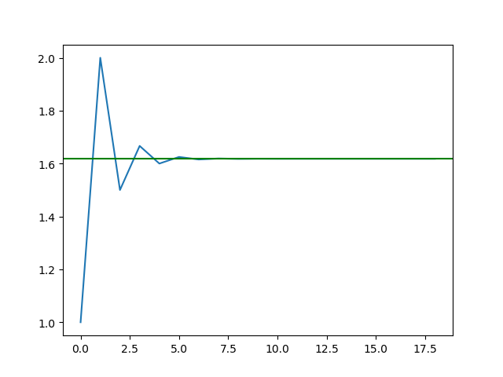
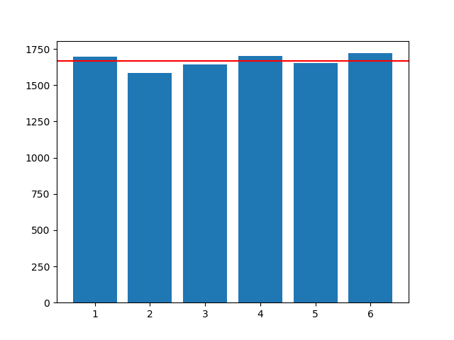
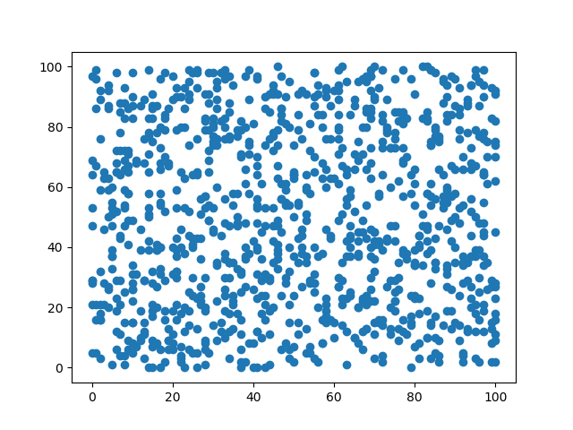
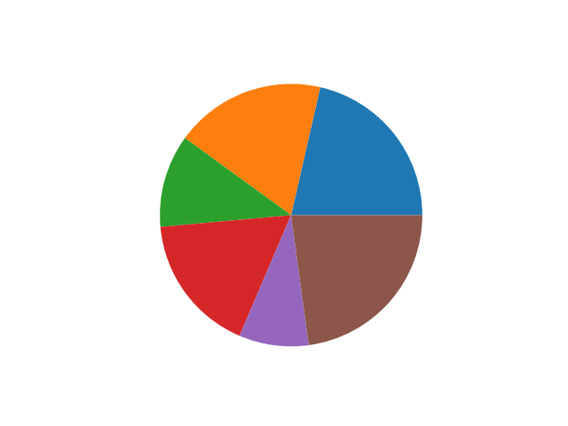

# Domáca úloha 8
Na úložisku pre odovzdávanie zadaní nájdete skript s názvom `h08.py`, ktorý obsahuje metódy pre generovanie údajov. Vašou úlohou je doplniť implementáciu funkcie pre vizualizáciu týchto údajov pomocou knižnice `matplotlib`, pričom máte jednu úlohu zo štyroch variantov:

* variant A - `plot_estimates` - ak zoberieme susedné čísla z Fibonacciho postupnosti a vypočítame ich podiel, dostaneme stále presnejšiu aproximáciu zlatého rezu (skutočná hodnota 1.618 - zhodou okolností udáva aj zložitosť rekurzívneho výpočtu Fibonacciho čísel: *O(1.618 ^ n)*). Pre generovanie odhadov máte implementovanú funkciu `get_estimates`. Pomocou `matplotlib`u vizualizujte zmenu týchto odhadov a pridajte horizontálnu čiaru inej farby pre reprezentáciu skutočnej hodnoty. **Nezabudnite pridať názvy osí a grafu**, samotný graf môže vyzerať nasledovne:

* variant B - `plot_distribution` - v úlohe chceme vizualizovať distribúciu hodnôt pri náhodnom výbere (napr. hod kockou). Pomocou `matplotlib`u vizualizujte početnosť jedinečných hodnôt v zozname náhodne generovaných hodnôt ako histogram (koľkokrát sme mali 1, 2, 3, ...). Na generovanie čísel slúži funkcia `generate_numbers`. Do grafu pridajte aj horizontálnu čiaru inej farby pre reprezentáciu početnosti pri uniformnom rozdelení (hodnotu dostanete ako podiel celkového počtu generovaných čísel a počtu jedinečných čísel). **Nezabudnite pridať názvy osí a grafu**, samotný graf môže vyzerať nasledovne:

* variant C - `plot_points` - v úlohe chceme vizualizovať náhodne vygenerované body v dvojrozmernom priestore. Tieto body sú vygenerované pomocou funkcie `generate_points`, Vašou úlohou je doplniť implementáciu funkcie `plot_points`, v ktorej pomocou `matplotlib`u vykreslíte na plátno body. **Nezabudnite pridať názvy osí a grafu**, samotný graf môže vyzerať nasledovne:

* variant D - `draw_chart` - v úlohe chceme vizualizovať rozdelenie hodnotení v rámci triedy pomocou koláčového grafu (*pie chart*). Vo funkcii `generate_grades` sa vygeneruje zoznam známok pre *n* študentov, Vašou úlohou je doplniť funkciu `draw_chart`, aby tá pomocou `matplotlib`u vykreslila rozdelenie týchto známok. **Do vizualizácie pridajte legendu (ktorá farba ktorú známku označuje) a názov grafu**, samotný graf môže vyzerať nasledovne:

