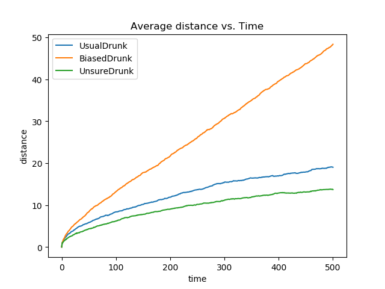

# Domáca úloha 9
Na úložisku pre odovzdávanie zadaní nájdete skript s názvom `h09.py`, ktorý obsahuje kód pre random walk z prednášky. Vašou úlohou je doplniť funkcionalitu biased random walku (metóda `move`) pre triedy `BiasedDrunk` a `UnsureDrunk` nasledovne:

* `BiasedDrunk` - reprezentuje človeka, ktorý sa do rôznych smerov vyberie rôznymi pravdepodobnosťami. Pravdepodobnosti nájdete v komentároch v definícii funkcie `move`. Aktér ďalej urobí dlhší krok vo vybranom smere (smer určený v komentároch na rovnakom mieste).
* `UnsureDrunk` - nikdy neurobí krok v tom istom smere dvakrát po sebe.

Triedy môžete rozširovať podľa potreby.

Následne upravte funkciu `ansQuest` tak, aby sa vykreslili tri krivky, všetky budú reprezentovať priemernú prekonanú vzdialenosť rôznymi typmi ľudí. Do grafu pridajte aj legendu, aby bolo jasné, ktorá krivka ktorého opilca reprezentuje, napríklad takto:

## Hodnotenie
* `BiasedDrunk` - 0,5b (správne pravdepodobnosti - 0,25b; správna dĺžka kroku - 0,25b)
* `UnsureDrunk` - 0,5b
* vizualizácia výsledkov - 1b
